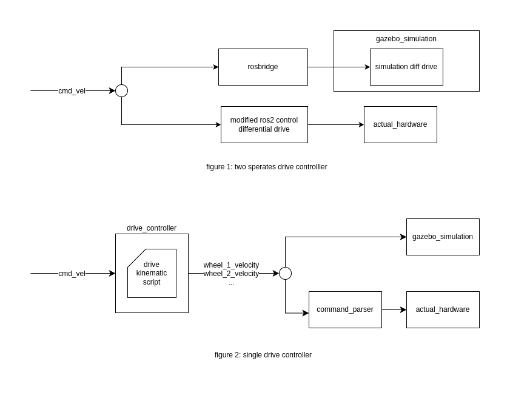

# Description
It converts twist message (/cmd_vel) into left and right wheel speed based on the differential drive kinematics



# How to run
You can either run it as an individual node or use the launch file provided

```bash
# Individual node
ros2 run dd_controller dd_controller --ros-args -p wheelbase:=0.7
# Using launch file
ros2 launch dd_controller dd_controller.launch.py
```