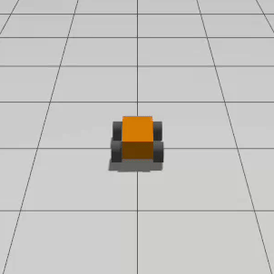

# Description
It converts twist message (/cmd_vel) into left and right wheel speed based on the differential drive kinematics. It works with both two wheel drive and four wheel drive.

I created this drive controller because if you use the drive controller provided by ros2-control, you need two seperate drive controllers, one for your hardware and one for your simulation. With these package, you just need to map the corresponding topic to the hardware and simulation.


# How to run
You can either run it as an individual node or use the launch file provided

1. run as individual node
```bash
ros2 run dd_controller dd_controller --ros-args -p wheelbase:=0.7
```

2. include in your launch file
```bash
    dd_controller = Node(
        package='dd_controller',
        executable='dd_controller',
        name='dd_controller',
        output='screen',
        parameters=[{
            'wheel_base': 0.4,
            'wheel_radius': 0.6,
            'left_wheels': ['front_left_wheel', 'back_left_wheel'],
            'right_wheels': ['front_right_wheel', 'back_right_wheel']
        }]
        ) 
    )
```

